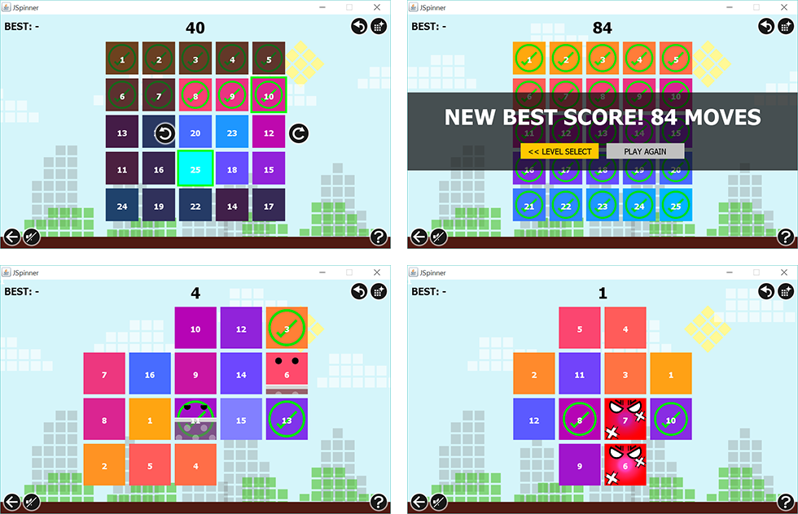

# JSpinner
An original puzzle game

[>>> Download <<<](JSpinner.jar?raw=true)

## The Game
JSpinner is a puzzle game inspired from Rubik's Cube and the legendary Fifteen Puzzle.  The game consists of a grid of numbers shuffled randomly. In order to win,  the player must move the tiles on the grid by turning a square group of them clockwise or counter-clockwise and arrange the numbers on each tiles in order. As simple as that.

## Screenshots



## Special Tiles
Apart from normal gameplay, we provided the "Adventure Mode" which contains new types of tiles:
- **The Sleepy Tiles** will sleep and be awake each three turns: it cannot be moved while sleeping
- **The Angry Tiles** when two of them sits together for two turns, they will fight and shuffle the board for several moves

## Level Files
You can create your own level by making a text file similar to this and load it in the Level Select screen of the game.
```
6 6
- - s s - -
- z s s a -
s s s s s s
s s s s s s
- a s s z -
- - s s - -
```
- The first `6` means the board will consists of 6 rows.
- The second `6` means the board will consists of 6 columns.
- following lines is the type of tiles on the board
  - `-` means there are no tiles in that area of the board
  - `s` means a simple (normal) tile
  - `z` means a sleepy tile
  - `a` means an angry tile

## About This Game
JSpinner is a final project for the Programming Methodologies Class of 2014 (2nd year) 
as a part of computer engineering curriculum of Chulalongkorn University.
 
created by Thanawit Prasongpongchai and Phatrasek Jirabovonvisut
