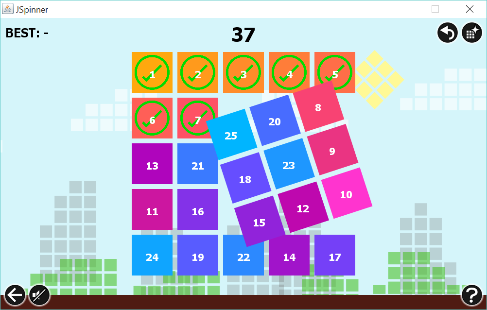
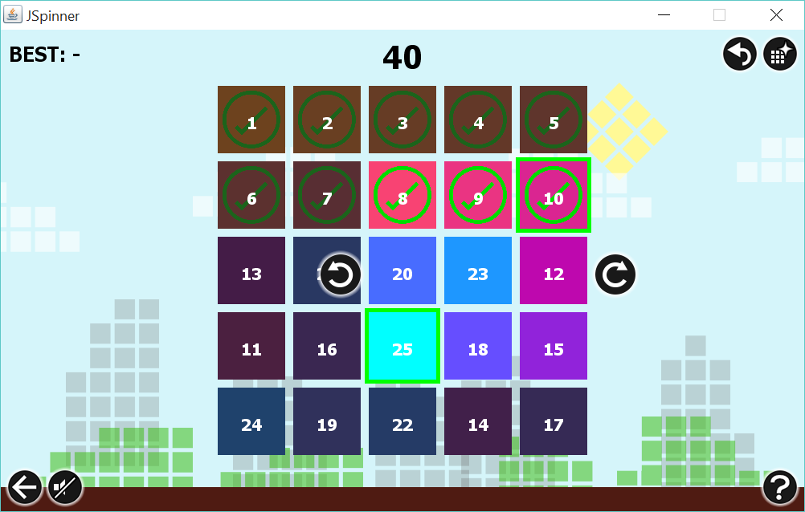
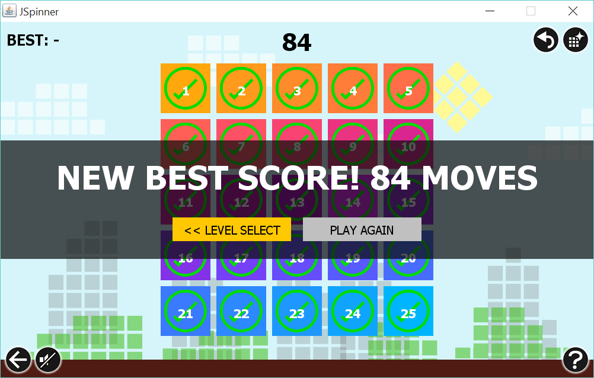
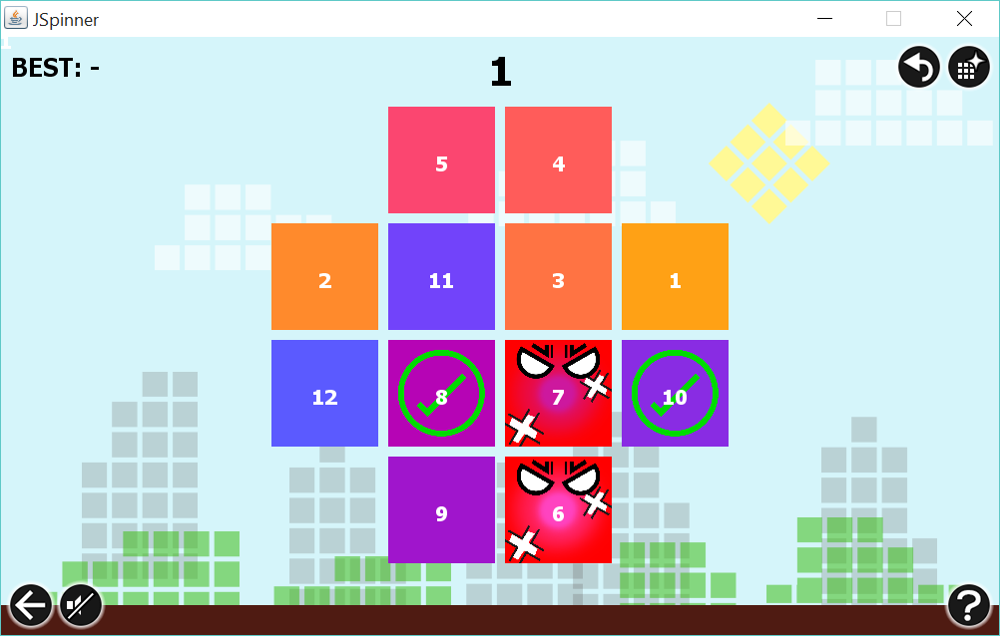
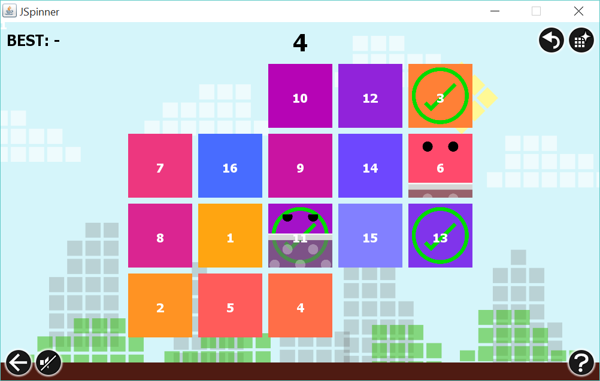
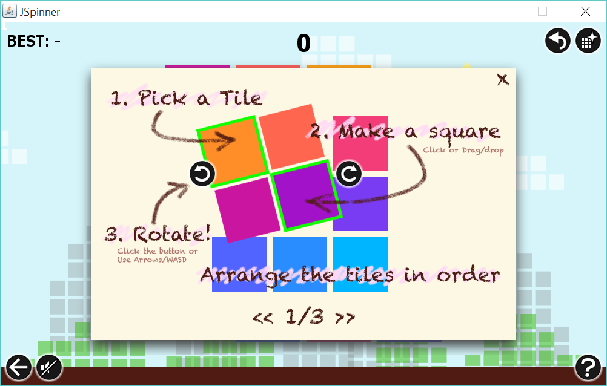
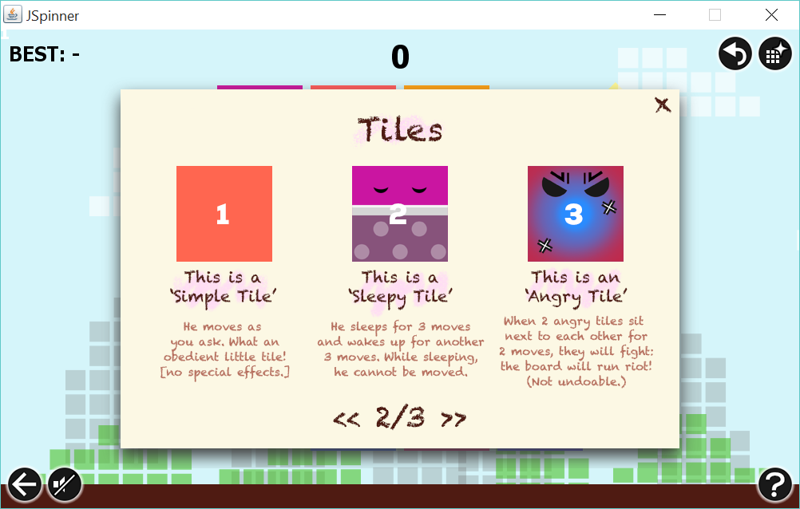
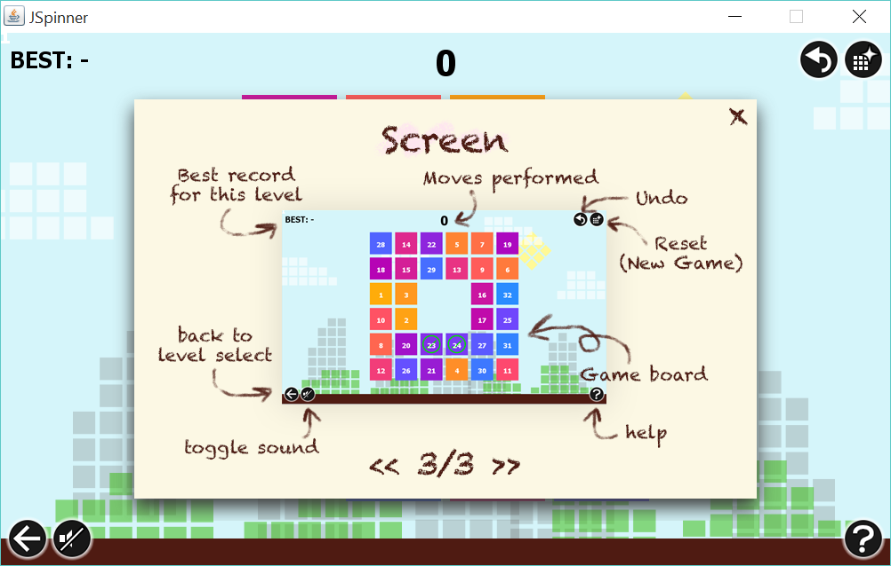

# JSpinner
An original puzzle game

[>>> Download <<<](Jspinner.jar)

Final Project for the Programming Methodologies Class of 2014 (2nd year) 
as a part of computer engineering curriculum of Chulalongkorn University. 

by Thanawit Prasongpongchai and Phatrasek Jirabovonvisut

## Screenshots

## Game Instructions

